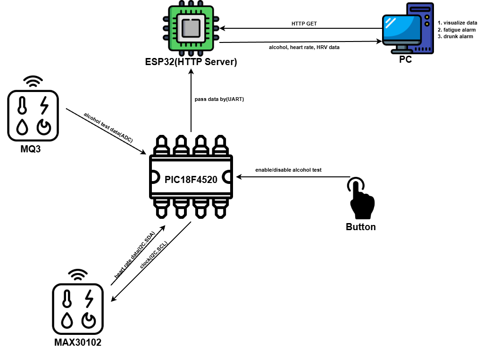

# MCU Driver Monitor

Embedded monitoring prototype built around a `PIC18F4520`, `MAX30102`, `MQ-3`, and an `ESP32` bridge. The PIC samples pulse and alcohol-sensor data, the ESP32 exposes the latest values over HTTP, and the desktop app visualizes the stream.

This repository is coursework/prototyping code. It is not a medical device and should not be used to determine fitness to drive.

## Repository Layout

```text
mcu_final/
|- pic.X/                 MPLAB X + XC8 firmware for the PIC18F4520
|- esp32/                 PlatformIO project for the ESP32 HTTP bridge
|- Safe_driver_monitor/   PyQt6 desktop monitor and data processing
|- docs/                  Project documentation
`- images/                Diagrams and screenshots
```

## System Overview



1. The PIC reads IR values from the `MAX30102` over I2C.
2. The PIC reads the `MQ-3` analog output through the ADC when the mode is enabled.
3. The PIC streams `IR,alcohol` samples over UART.
4. The ESP32 parses the UART stream, calculates heart-rate metrics, and serves JSON at `GET /test`.
5. The desktop monitor polls the ESP32 and renders the processed data.

## Components

### `pic.X`

- Target: `PIC18F4520`
- Tooling: MPLAB X + XC8
- Responsibilities:
  - initialize UART, I2C, ADC, and button interrupts
  - read `MAX30102` FIFO samples
  - sample the `MQ-3` sensor
  - stream lines in the format `IR,AC\n`

### `esp32`

- Tooling: PlatformIO with Arduino framework
- Responsibilities:
  - connect to Wi-Fi
  - receive UART data from the PIC
  - compute heart-rate / HRV values
  - expose the latest payload as JSON over HTTP

Expected response from `GET /test`:

```json
{"AC":123,"HR":72,"HRV":38.5}
```

### `Safe_driver_monitor`

- Tooling: Python + PyQt6
- Responsibilities:
  - poll the ESP32 endpoint
  - process incoming JSON
  - display values in a desktop UI
  - store daily records

## Hardware Notes

Core hardware used in this project:

| Part | Model | Purpose |
| --- | --- | --- |
| MCU | PIC18F4520 | Sensor sampling, ADC, UART bridge |
| Pulse sensor | MAX30102 | PPG / IR sampling over I2C |
| Alcohol sensor | MQ-3 | Analog alcohol reading |
| Wi-Fi bridge | ESP32 DevKit | HTTP server and metric calculation |

Typical wiring used by the code:

- `PIC18F4520 RC3/RC4` -> `MAX30102 SCL/SDA`
- `PIC18F4520 AN0` -> `MQ-3 analog output`
- `PIC18F4520 UART TX` -> `ESP32 UART RX`
- Shared `GND` across all boards

## Setup

### PIC firmware

Open the `pic.X` project in MPLAB X, build with XC8, and flash the `PIC18F4520`. Generated output under `pic.X/dist` is intentionally ignored and should not be committed.

### ESP32 bridge

1. Edit [esp32/src/main.cpp](/c:/Users/bryan/Desktop/Projects/mcu_final/esp32/src/main.cpp) and set:
   - `SSID`
   - `PASS`
   - `PC_IP` if you use it in your local workflow
2. Build and upload from [esp32/platformio.ini](/c:/Users/bryan/Desktop/Projects/mcu_final/esp32/platformio.ini):

```bash
cd esp32
pio run
pio run --target upload
```

After boot, the ESP32 prints its IP address to serial and starts the HTTP server on port `80`.

### Desktop monitor

Install the Python dependencies, then start the monitor:

```bash
cd Safe_driver_monitor
pip install -r requirements.txt
python main.py
```

Before launching, update `SERVER_IP` in [Safe_driver_monitor/main.py](/c:/Users/bryan/Desktop/Projects/mcu_final/Safe_driver_monitor/main.py) so it points to your ESP32.

## Testing the HTTP Endpoint

Once the ESP32 is online, query the endpoint directly:

```bash
curl http://<ESP32_IP>/test
```

## Demo

- Video: https://www.youtube.com/watch?v=p8hfKhod48c

## Notes

- The desktop app depends on the ESP32 endpoint being reachable on the local network.
- Some source files contain comments or log strings with encoding damage; that cleanup is separate from the repository hygiene changes here.
- The repository includes a more detailed project description in [docs/Description.pdf](/c:/Users/bryan/Desktop/Projects/mcu_final/docs/Description.pdf).
